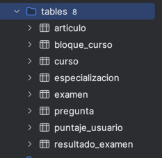
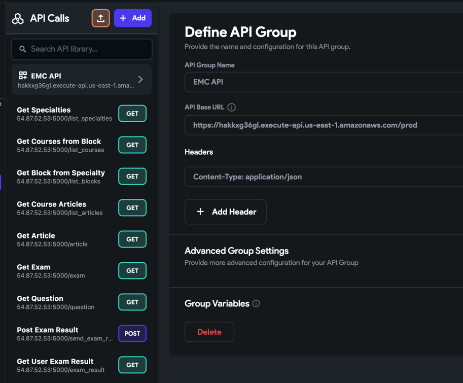
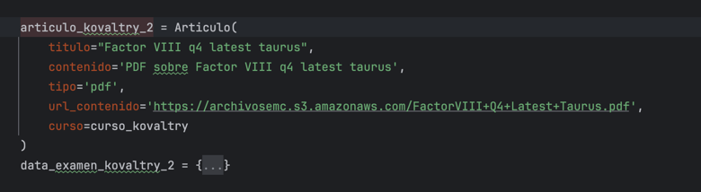

# Xaldigital EMC Mobile App Backend

Implementación del Backend para la aplicación Mobile en Flutterflow con Custom Authentication usando AWS

* **Lenguaje Backend:** Python
* **Lenguaje Frontend:** Dart
* **Framework Backend:** Flask
* **Framework Frontend:** Flutter
* **Base de datos:** Postgresql
* **Lambda Functions con API Gateway:** runtime Node.js 20.x
* **Lógica de la aplicación:** Flask API creada dentro del proyecto con EC2.
* **Authentication:** AWS Cognito
* **Archivos PDF y Videos para los exámenes:** Archivos públicos en S3 de forma temporal
* **IoC:** Terraform

Documentación Javascript SDK AWS: https://docs.aws.amazon.com/AWSJavaScriptSDK/v3/latest/client/cognito-identity-provider/

https://repost.aws/questions/QUiL6x18g9Qk2XJk73Y4sE5A/enabling-cors-on-api-gateway

Modelos de la Aplicación:

Este proyecto debe ser desplegado en AWS usando Terraform y el API Gateway debe ser conectado a través de las API Calls de Flutterflow:

Al desplegar el proyecto se debe ejecutar en la ruta de EC2 en el endpoint: http://54.87.52.53:5000/initial_data.
Esta petición GET creará las Especializaciones, Exámenes y Bloques necesarios para el prototipo. Las especializaciones iniciales para el prototipo son Cardio Neumología y Hematología.

En la implementación Flask se encuentra toda la lógica para el cálculo de puntos, recompensas, y creación  de preguntas dentro de la base de datos usando SQL Alchemy

Para poder subir archivos de los artículos para los exámenes, 
hay que crear un Bucket de S3 de forma pública (prototipo) y copiar el link del PDF para Flutterflow pueda leerlo y consumirlo. Por ejemplo:

